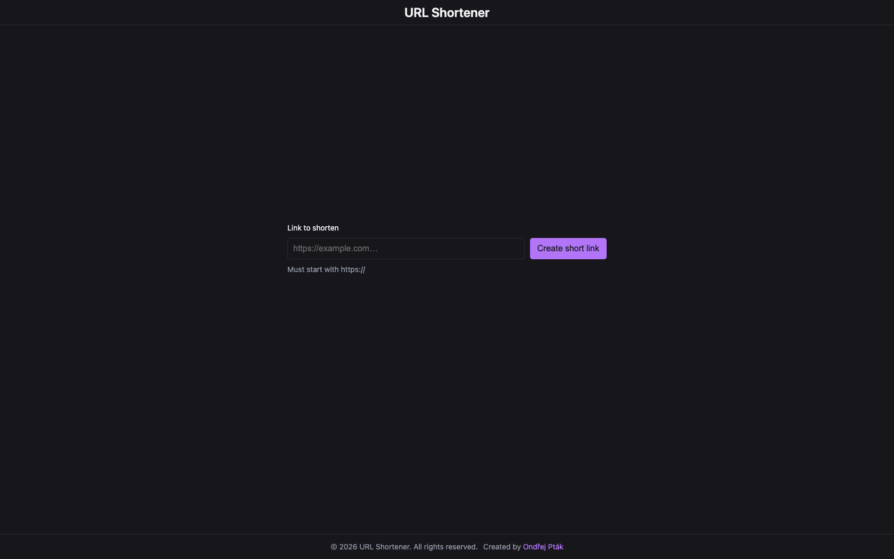
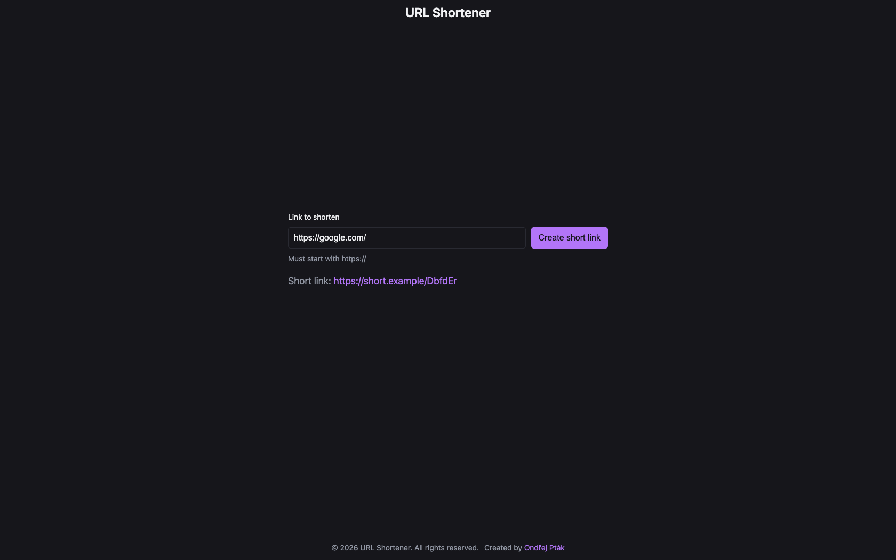
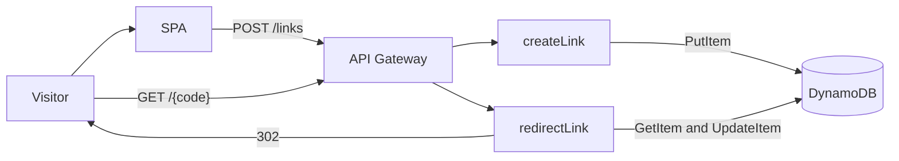

# URL shortener

A visitor pastes a Target URL, receives a Short link, and that Short link Redirects to the Target URL.

Create and Redirect are public HTTP endpoints. There is no sign-in.

<p align="center"></p>

<p align="center"></p>

## How it works

1. The visitor opens the SPA at `/` and enters a Target URL that starts with `https://`.
2. The SPA sends `POST /links` with `{ "url": "<Target URL>" }`.
3. The create function writes a mapping to DynamoDB and returns a Short link.
4. Opening that Short link calls `GET /{code}`. The redirect function loads the Target URL, increments `clickCount`, and responds with HTTP 302.

## Architecture



| Piece | Role |
| --- | --- |
| SPA in `web/` | One page at `/`. Create form and Short link result live on that page. Following a Short link is not an SPA route. |
| API Gateway HTTP API | `POST /links` and `GET /{code}` |
| Lambda `createLink` | Validate the Target URL, generate a Short code, write the item, return the Short link |
| Lambda `redirectLink` | Look up the Short code, increment `clickCount`, return 302 |
| DynamoDB `links-table` | Partition key `shortCode` (String) |

Both functions use the Node.js 22.x runtime. The AWS SDK region comes from the Lambda environment.

Each function has its own IAM role, granted in the CDK stack. Create may `dynamodb:PutItem`. Redirect may `dynamodb:GetItem` and `dynamodb:UpdateItem`.

## HTTP API

### `POST /links`

Creates a mapping.

Request body:

```json
{ "url": "https://example.com" }
```

| Status | When |
| --- | --- |
| 201 | Item written. Body is `{ "shortCode", "shortUrl" }`. `shortUrl` is `BASE_URL` plus `/` plus the Short code. |
| 400 | Body is not JSON, or the Target URL fails validation. |
| 500 | DynamoDB write failed. |

The Short code is `randomBytes(4).toString("base64url").slice(0, 7)`.

Stored item:

| Attribute | Meaning |
| --- | --- |
| `shortCode` | Opaque identifier in the Short link |
| `longUrl` | Target URL `href` after validation |
| `createdAt` | ISO-8601 timestamp |
| `clickCount` | Starts at `0` |

### `GET /{code}`

Resolves a Short link.

| Status | When |
| --- | --- |
| 302 | Mapping found. `Location` is the Target URL. `Referrer-Policy` is `no-referrer`. |
| 400 | Path has no Short code. |
| 404 | No item, or the stored URL fails validation. |
| 500 | Lookup failed. |

If `clickCount` cannot be updated, the function logs the error and still returns 302.

## Target URL rules

The SPA and the Lambdas share the same checks. A Target URL must:

- be a string that parses with `new URL()`
- use the `https:` protocol (`http:` is rejected)
- have a hostname
- be at most 2048 characters
- contain no control characters
- contain no username or password

## Repository

| Path | Contents |
| --- | --- |
| `web/` | React + Vite SPA. See [`web/README.md`](web/README.md). |
| `cdk/` | CDK stack, Lambda handlers, and IAM grants. See [`cdk/README.md`](cdk/README.md). |
| `docs/adr/` | Architecture decisions. |
| `docs/images/` | Screenshots and diagrams for this README. |
| `CONTEXT.md` | Domain terms: Visitor, Target URL, Short link, Short code, Redirect. |

Lambda env vars: `TABLE_NAME`, `BASE_URL`. The SPA uses `VITE_API_URL` (see `web/.env.example`).

Created by [Ondřej Pták](https://ondrejptak.dev).
